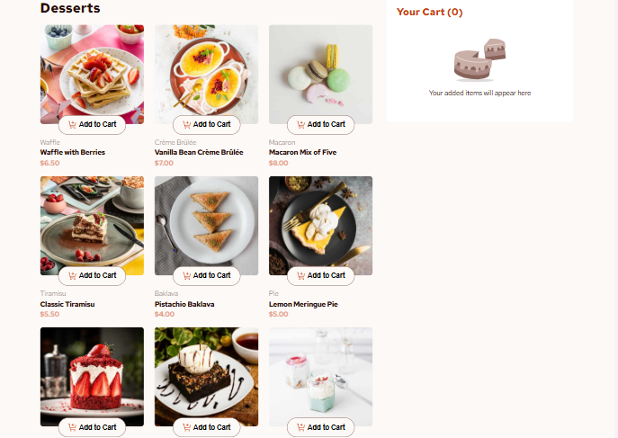

# Frontend Mentor - Product list with cart solution

This is a solution to the [Product list with cart challenge on Frontend Mentor](https://www.frontendmentor.io/challenges/product-list-with-cart-5MmqLVAp_d). Frontend Mentor challenges help you improve your coding skills by building realistic projects. 

## Table of contents

- [Overview](#overview)
  - [The challenge](#the-challenge)
  - [Screenshot](#screenshot)
  - [Links](#links)
- [My process](#my-process)
  - [Built with](#built-with)
  - [What I learned](#what-i-learned)
  - [Continued development](#continued-development)
  - [Useful resources](#useful-resources)
- [Author](#author)
- [Acknowledgments](#acknowledgments)

## Overview

### The challenge

Users should be able to:

- Add items to the cart and remove them
- Increase/decrease the number of items in the cart
- See an order confirmation modal when they click "Confirm Order"
- Reset their selections when they click "Start New Order"
- View the optimal layout for the interface depending on their device's screen size
- See hover and focus states for all interactive elements on the page

### Screenshot



### Links

- Live Site URL: [Add live site URL here](https://esther-product-list.netlify.app/)

## My process

### Built with

- Semantic HTML5 markup
- CSS custom properties
- Flexbox
- CSS Grid
- JavaScript

### What I learned

This project helped me enhance my understanding of JavaScript for DOM manipulation and event handling. Here’s a snippet I’m particularly proud of:

```js
function setupIncrementDecrement(button, product) {
    let cartItem = cart.find((item) => item.id === product.id);
    let quantity = cartItem ? cartItem.quantity : 1;

    button.innerHTML = `   
        <span class="decrement">
            <svg xmlns="http://www.w3.org/2000/svg" width="10" height="2" fill="currentColor" viewBox="0 0 10 2" class="increment-icon">
                <path d="M0 .375h10v1.25H0V.375Z" />
            </svg>
        </span>
        <span class="quantity">${quantity}</span>
        <span class="increment">
            <svg xmlns="http://www.w3.org/2000/svg" width="10" height="10" fill="currentColor" viewBox="0 0 10 10" class="decrement-icon">
                <path d="M10 4.375H5.625V0h-1.25v4.375H0v1.25h4.375V10h1.25V5.625H10v-1.25Z" />
            </svg>
        </span>
    `;

    const decrementBtn = button.querySelector(".decrement");
    const incrementBtn = button.querySelector(".increment");
    const quantityDisplay = button.querySelector(".quantity");
    const productCard = button.closest(".product-card");
    const productImage = productCard.querySelector(".product-image");

    decrementBtn.onclick = () => {
        if (quantity > 1) {
            quantity--;
            quantityDisplay.textContent = quantity;
            updateCartQuantity(product, quantity);
        } else {
            
            // Reset to default "Add to Cart" button
            button.innerHTML = `
                
                Add to Cart
            `;

            button.classList.remove("active");
            productImage.classList.remove("active");

            // Remove all event listeners
            const newButton = button.cloneNode(true);
            button.parentNode.replaceChild(newButton, button);

            // Add the original click event back
            newButton.addEventListener("click", () => handleAddToCart(product.id, newButton));

            // Remove from cart
            removeFromCart(product.id);
        }
    };

    incrementBtn.onclick = () => {
        quantity++;
        quantityDisplay.textContent = quantity;
        updateCartQuantity(product, quantity);
    };
}
```

### Continued development

In future projects, I aim to:

- Enhance code reusability by implementing modular JavaScript.
- Focus more on improving accessibility (e.g., keyboard navigation and ARIA roles).
- Optimize performance for large datasets by using virtualized lists.

### Useful resources

- [MDN Web Docs ](https://developer.mozilla.org/en-US/) - A helpful resource for JavaScript and CSS documentation.
- [CSS Trick](https://css-tricks.com/) - Provided great insights into responsive design techniques.

## Author

- Website - [Esther AJAYI](https://esthercoders.netlify.app)
- Frontend Mentor - [@esther-must](https://www.frontendmentor.io/profile/esther-must)
- Twitter - [@adexdainty92](https://x.com/adexdainty92)

## Acknowledgments

I would like to thank the Frontend Mentor community for their valuable feedback and support. Special thanks to Open AI for their guidance during this project.

